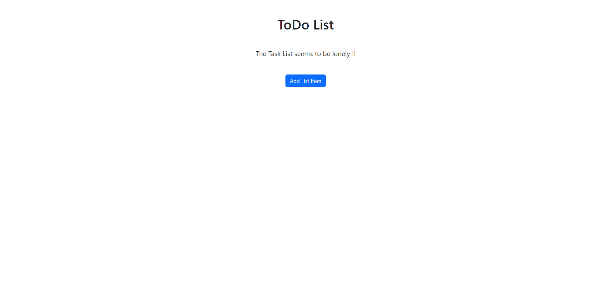
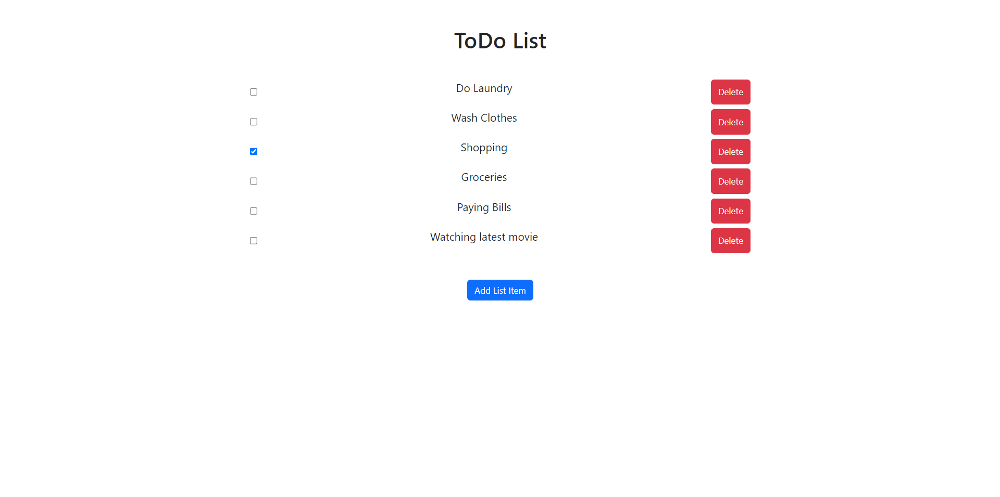

Project Title :

"TODO Application".

Running the application:

To run the application in a local server run the following command in your text editor's terminal "npm start ".

About the project:

TODO Application is small and simple application that can be used to keep track of the daily tasks or chores to be done. A user can mark the taks that has been completed and also delete the tasks that are no longer required.

Technologies and dependencies used:

HTML, CSS, JavaScript, ReactJS, Bootstrap ( CSS framework), uuid v4, Redux Toolkit.

Screenshots:

